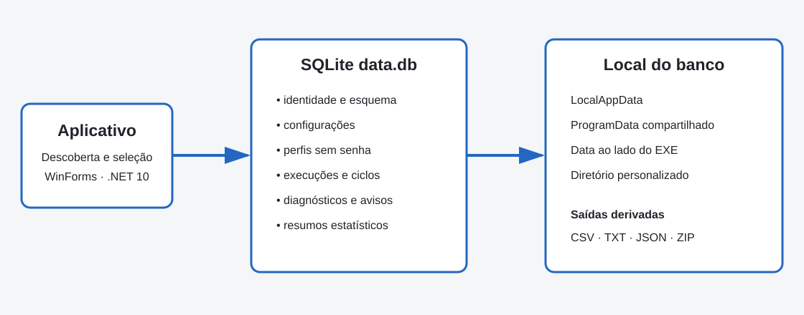
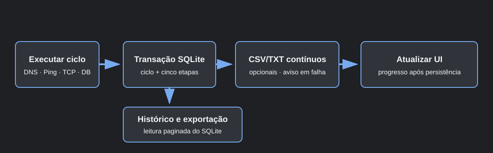

# DB Connection Tester

Aplicativo Windows portátil para testar repetidamente cada camada envolvida no acesso a bancos de dados: DNS, Ping/ICMP, TCP, conexão ADO.NET e `SELECT 1`.

**Versão atual:** `2.0.0`



## Principais recursos

- Histórico SQLite persistente com execuções, ciclos, diagnósticos, avisos e estatísticas.
- Perfis reutilizáveis sem senha ou connection string persistida.
- Interface WinForms navegável com temas Sistema, Claro e Escuro.
- Filtros, paginação, detalhes e gráficos de latência no histórico.
- Exportação posterior de qualquer execução em CSV, TXT, JSON ou ZIP.
- CSV/TXT contínuos opcionais, desligados por padrão para compatibilidade com a versão 1.x.
- Armazenamento Local, Compartilhado, Portátil ou Personalizado.
- Pacote portátil com backup consistente, manifesto e checksums SHA-256.
- Recuperação de execuções interrompidas e bloqueio de uma única execução escritora por banco.
- Execução em primeiro plano ou na bandeja do Windows.

## Bancos suportados

| Tipo | Provider .NET | Porta padrão |
|---|---|---:|
| MySQL / MariaDB | `MySqlConnector` | 3306 |
| PostgreSQL | `Npgsql` | 5432 |
| SQL Server | `Microsoft.Data.SqlClient` | 1433 |
| SAP SQL Anywhere | `System.Data.Odbc` | 2638 |
| SQLite | `Microsoft.Data.Sqlite` | — |
| Somente TCP | — | Editável |

Cada ciclo abre uma nova conexão sem pooling para medir conexão e autenticação reais. SQLite é aberto em modo somente leitura. SQL Anywhere requer um driver ODBC da mesma arquitetura do aplicativo.

## Armazenamento

O aplicativo procura bancos compatíveis nos locais conhecidos e usa o banco para armazenar sua própria identidade e configuração:

| Modo | Caminho padrão |
|---|---|
| Local | `%LOCALAPPDATA%\DBConnectionTester\data.db` |
| Compartilhado | `%PROGRAMDATA%\DBConnectionTester\data.db` |
| Portátil | `<pasta-do-exe>\Data\data.db` |
| Personalizado | Pasta selecionada ou `--data-dir <pasta>` |

Uma escolha explícita sempre vence. Sem escolha, a preferência válida do usuário é reutilizada; uma mídia portátil ainda não observada ou vários bancos sem preferência abrem o seletor. Se nenhum banco existir, o modo Local é criado. Bancos inválidos ou com esquema futuro nunca são sobrescritos.

Consulte [Arquitetura de armazenamento](docs/storage.md) para regras de descoberta, troca, concorrência e ProgramData.

## Perfis, histórico e exportação

Perfis guardam apenas parâmetros não secretos. A senha é informada na tela de execução e permanece somente na memória. Cada execução recebe um snapshot sanitizado, portanto continua íntegra mesmo após alteração ou exclusão do perfil.

O Histórico permite filtrar por período, perfil, destino, estado e diagnóstico. CSV, TXT, JSON e ZIP são gerados a partir do banco, sem depender dos arquivos contínuos. O [esquema JSON v1](docs/export-json-schema.md) é estável e documentado.



## Portabilidade

Em **Configurações**, é possível:

- clonar o armazenamento atual para outro modo;
- criar um armazenamento vazio;
- selecionar um `data.db` existente;
- criar um pacote portátil com ou sem o EXE single-file;
- restaurar um pacote para uma pasta vazia.

Nenhuma operação mescla bancos, substitui destinos ocupados ou apaga o banco anterior. Veja [Pacotes portáteis](docs/portable-packages.md).

## Segurança

- Senhas e connection strings não são gravadas no banco, relatórios, JSON, ZIP ou logs.
- CSV neutraliza valores que poderiam ser interpretados como fórmulas.
- Pacotes validam caminhos internos e SHA-256 antes da restauração.
- A preparação compartilhada eleva somente um processo auxiliar do próprio EXE e somente para `%PROGRAMDATA%\DBConnectionTester`.
- O aplicativo principal não permanece elevado.

Leia [Segurança e privacidade](docs/security.md) e a [documentação dos diagnósticos](docs/diagnostics/README.md).

## Downloads

Cada release oferece três artefatos Windows x64:

- **Framework-dependent ZIP:** requer o [.NET 10 Desktop Runtime](https://dotnet.microsoft.com/download/dotnet/10.0).
- **Self-contained ZIP:** inclui o runtime e mantém os arquivos separados.
- **Self-contained EXE:** arquivo único pronto para executar.

Cada artefato possui checksum SHA-256. O EXE único é validado pela CI para permanecer abaixo de 120 MiB.

## Compilar e testar

Requisitos: Windows x64 e .NET 10 SDK.

```powershell
dotnet restore tests/DBConnectionTester.Tests/DBConnectionTester.Tests.csproj
dotnet build DBConnectionTester.sln -c Release --no-restore
dotnet test tests/DBConnectionTester.Tests/DBConnectionTester.Tests.csproj -c Release --no-build
dotnet run --project DBConnectionTester.csproj
```

Gerar e validar os três artefatos:

```powershell
./build/Publish-Release.ps1
```

Os arquivos são gravados em `artifacts/`. A automação de release é executada em push e pull request; uma tag compatível com [VERSION](VERSION) também publica a GitHub Release.

## Documentação

- [Arquitetura de armazenamento](docs/storage.md)
- [Formato JSON exportado](docs/export-json-schema.md)
- [Pacotes portáteis](docs/portable-packages.md)
- [Segurança e privacidade](docs/security.md)
- [Solução de problemas](docs/troubleshooting.md)
- [Códigos de diagnóstico](docs/diagnostics/README.md)
- [Histórico de versões](CHANGELOG.md)

## Desenvolvedor

Desenvolvido por [Guilherme Garcia](https://github.com/GUILHERME-GARCIATECH).

## Licença

Distribuído sob a [Licença MIT](LICENSE).
