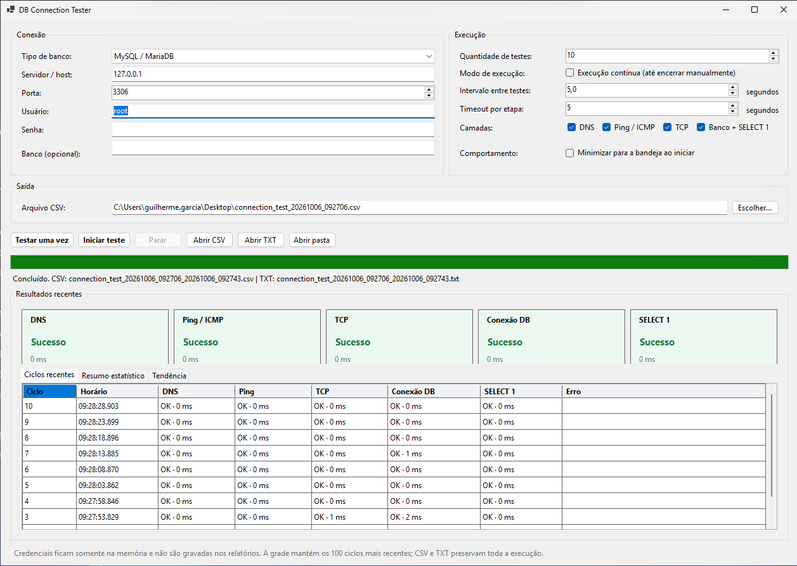

# DB Connection Tester

Aplicativo Windows leve para testar, de forma repetida, cada camada envolvida no acesso a bancos de dados: DNS, Ping/ICMP, TCP, conexão ADO.NET e uma consulta `SELECT 1`.

**Versão atual:** `1.0.0`



## O que ele faz

- Executa uma quantidade definida de ciclos ou permanece em modo contínuo.
- Permite ligar e desligar DNS, Ping, TCP e banco de forma independente.
- Exibe o resultado de cada camada, os 100 ciclos mais recentes e uma tendência compacta.
- Calcula taxa de sucesso, média, mínimo, máximo, mediana, p95 e sequências de falhas.
- Classifica falhas com código de diagnóstico, sugestão de correção e código original do provider.
- Exporta toda a execução para CSV e TXT com gravação contínua.
- Pode iniciar minimizado na bandeja e ser interrompido com segurança.
- Mantém credenciais somente em memória; senha e connection string não são gravadas.

Mais detalhes sobre códigos, sugestões e mapeamentos estão na [documentação do diagnóstico inteligente](docs/diagnostics/README.md).

## Bancos suportados

| Tipo | Provider .NET | Porta padrão |
|---|---|---:|
| MySQL / MariaDB | `MySqlConnector` | 3306 |
| PostgreSQL | `Npgsql` | 5432 |
| SQL Server | `Microsoft.Data.SqlClient` | 1433 |
| SAP SQL Anywhere | `System.Data.Odbc` | 2638 |
| SQLite | `Microsoft.Data.Sqlite` | — |
| Somente TCP | — | Editável |

Cada ciclo abre uma nova conexão sem pooling, para que a medição represente conexão e autenticação reais. SQLite é aberto em modo somente leitura. SQL Anywhere requer que o driver ODBC correspondente esteja instalado na mesma arquitetura do aplicativo.

## Downloads

Cada release oferece dois pacotes para Windows x64:

- **Framework-dependent:** menor; requer o [.NET Desktop Runtime 8](https://dotnet.microsoft.com/download/dotnet/8.0).
- **Self-contained:** maior; inclui o runtime e não requer instalação do .NET.

Os dois ZIPs mantêm o executável e suas DLLs como arquivos separados. Releases são criadas automaticamente ao publicar uma tag compatível com o arquivo [VERSION](VERSION), por exemplo `v1.0.0`.

## Compilar e testar

Requisitos: Windows e .NET 8 SDK.

```powershell
dotnet restore DBConnectionTester.sln
dotnet build DBConnectionTester.sln --configuration Release
dotnet test DBConnectionTester.sln --configuration Release
dotnet run --project DBConnectionTester.csproj
```

Os testes automatizados não dependem de servidores reais. A conectividade de cada provider deve ser validada contra uma instância disponível no ambiente de destino.

## Saídas

O CSV usa UTF-8 com BOM e separador por ponto e vírgula. O TXT registra cada ciclo e o resumo estatístico. Etapas desabilitadas são registradas como `N/A`, e os diagnósticos preservam código interno, sugestão, SQLSTATE e código nativo quando disponíveis.

## Desenvolvedor

Desenvolvido por [Guilherme Garcia](https://github.com/GUILHERME-GARCIATECH).

## Licença

Distribuído sob a [Licença MIT](LICENSE).
