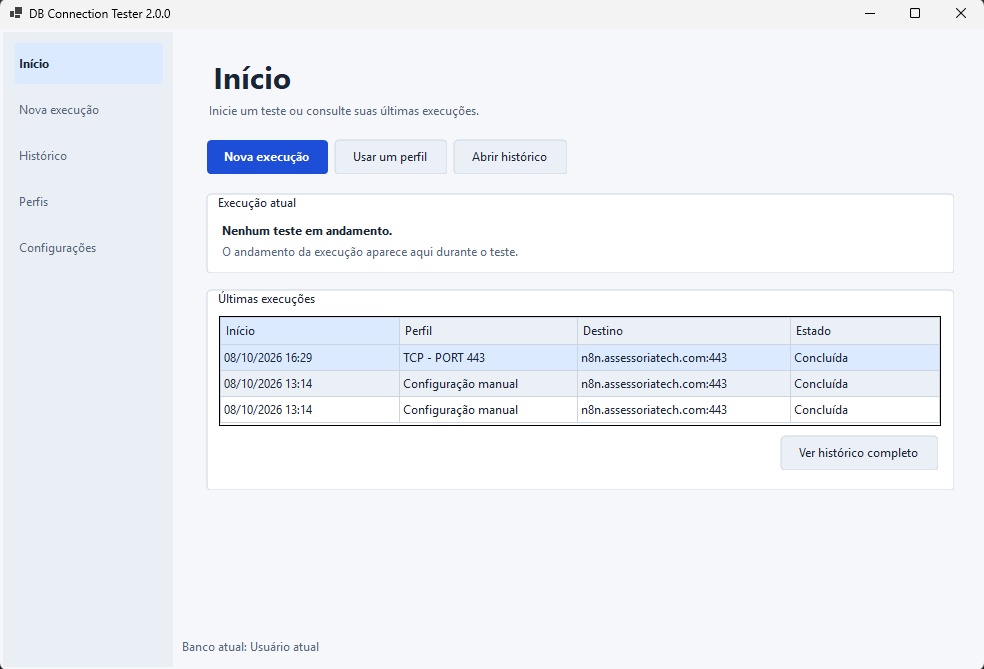
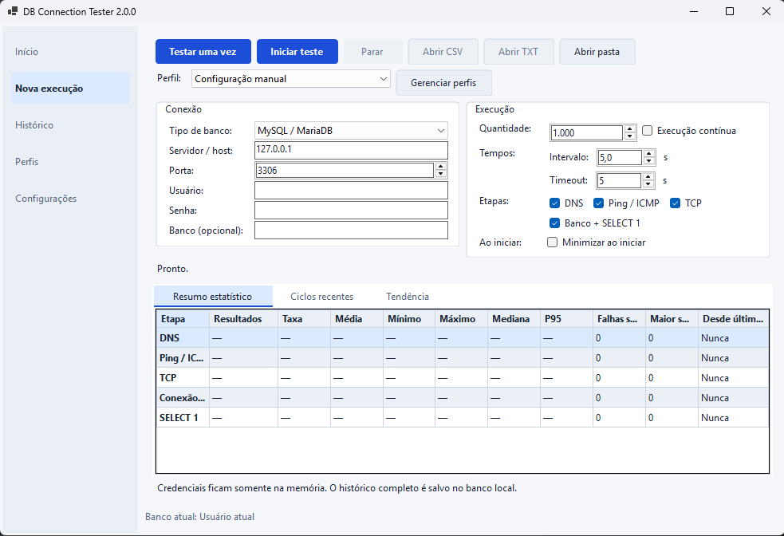
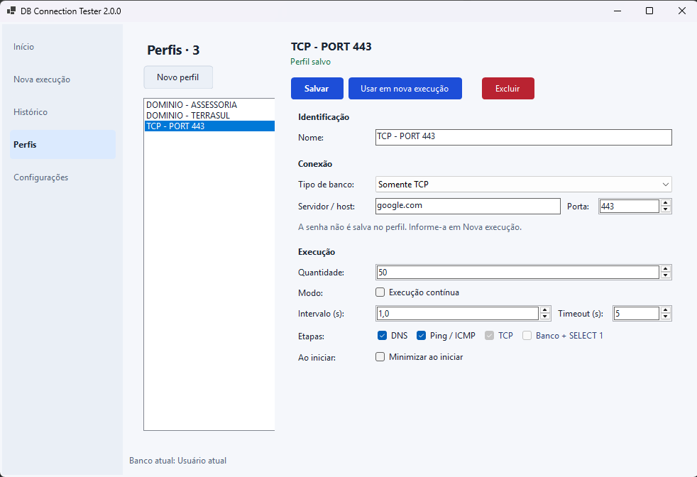
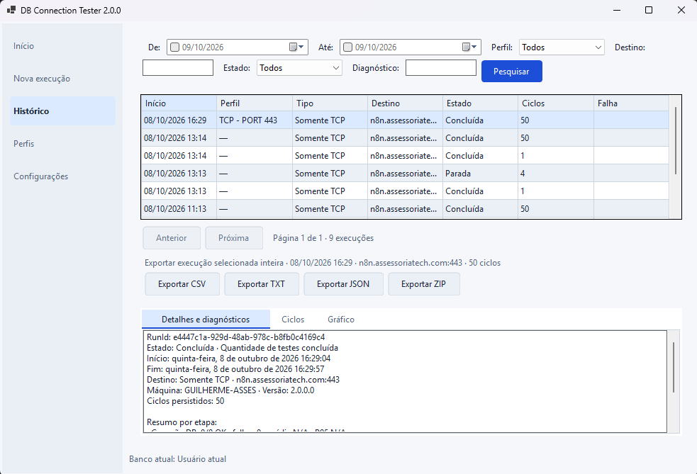
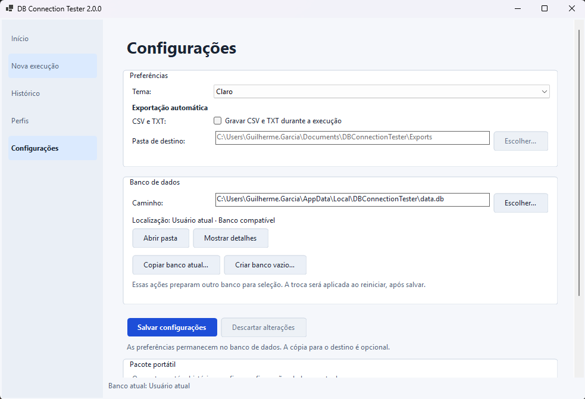
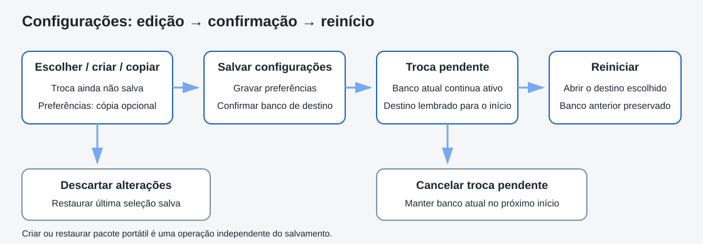

# Guia dos painéis e fluxos

## Início

O Início reúne **Nova execução**, **Usar um perfil** e **Abrir histórico**. Exibe o estado da execução atual e as três últimas execuções persistidas. **Ver histórico completo** abre a consulta detalhada. Não é um dashboard de todas as execuções nem inicia testes automaticamente.

## Nova execução

1. Escolha **Configuração manual** ou um perfil no seletor. **Gerenciar perfis** abre a página de edição.
2. Em **Conexão**, escolha o tipo e preencha os campos aplicáveis. SQLite usa um arquivo; SQL Server permite autenticação Windows ou SQL; SQL Anywhere usa o nome do driver ODBC.
3. Informe a senha quando exigida. Ela não é carregada de um perfil e fica somente na memória.
4. Em **Execução**, defina quantidade ou execução contínua, intervalo, timeout por etapa e as etapas desejadas.
5. **Testar uma vez** executa um ciclo, sem intervalo. **Iniciar teste** usa os parâmetros configurados.

O intervalo é uma espera entre ciclos, após concluir o anterior; não garante uma frequência fixa. Quantidade aceita de 1 a 10.000.000, intervalo de 0 a 3.600 segundos e timeout de 1 a 120 segundos. Nem todas as etapas se aplicam a todos os tipos; por exemplo, Somente TCP não executa conexão ADO.NET ou `SELECT 1`.

**Resumo estatístico** é a aba inicial. **Ciclos recentes** apresenta os últimos resultados visuais e **Tendência** permite acompanhar latência por etapa. O histórico completo permanece no SQLite, mesmo que a grade visual mostre apenas resultados recentes.

Durante a execução, a configuração fica bloqueada, mas a navegação e o Histórico continuam disponíveis. O progresso fica entre os parâmetros e as abas de resultado. Execução contínua mostra contagem e tempo, sem porcentagem de conclusão.

### Parar, bandeja e sair

**Parar** solicita cancelamento; os ciclos já confirmados permanecem no histórico. Marcar **Minimizar ao iniciar** inicia a sequência em segundo plano. Fechar a janela durante uma execução a oculta na bandeja; use o menu da bandeja para reabrir, parar ou sair. Sair com execução ativa pede confirmação e aguarda a finalização.

**Abrir CSV** e **Abrir TXT** ficam disponíveis quando arquivos contínuos foram gerados. Para obter relatórios quando essa saída está desligada, use o Histórico.

## Perfis

**Novo perfil** prepara uma edição. Preencha identificação, conexão e valores padrão da execução; **Salvar** persiste o perfil. **Usar em nova execução** aplica o perfil ao formulário, sem iniciar um teste. É possível selecionar o mesmo perfil diretamente em Nova execução.

Ao trocar de perfil, sair da página ou fechar a aplicação com edições, o aplicativo oferece salvar, descartar ou cancelar a saída. **Excluir** pede confirmação e preserva o histórico. O snapshot dos parâmetros usados em execuções anteriores não é reescrito ao editar um perfil; o vínculo e o nome exibido podem mudar ou desaparecer após exclusão.

## Histórico

Os filtros de data são opcionais: marque a caixa correspondente para aplicá-los. Também há perfil, destino, estado e diagnóstico. **Pesquisar** atualiza a consulta. A paginação de execuções é separada das exportações.

Selecione uma execução para abrir **Detalhes e diagnósticos**, **Ciclos** e **Gráfico**. As execuções são paginadas em grupos de 25; ciclos, em grupos de 100. Ciclos e gráfico são carregados quando necessários. O gráfico representa a página de ciclos indicada; as referências de mediana e P95 pertencem à execução inteira.

**Exportar CSV**, **TXT**, **JSON** ou **ZIP** inclui todos os ciclos da execução finalizada selecionada, independentemente da paginação. A escolha de execução é capturada antes de exportar; trocar a seleção durante a operação não muda o relatório em andamento. Os botões impedem exportações duplicadas enquanto uma operação está ativa. Após sucesso, **Abrir pasta** aponta para o destino gerado.

Use um nome de arquivo novo. Os serviços criam arquivos novos e recusam substituir um arquivo existente, mesmo se o diálogo de salvamento oferecer confirmação de substituição. Falhas de acesso ou SQLite aparecem como mensagem e permitem tentar novamente.

## Configurações

### Preferências

Escolha Sistema, Claro ou Escuro e, se necessário, habilite a gravação contínua de CSV/TXT e sua pasta de destino. **Salvar configurações** confirma as alterações. O tema é aplicado à janela aberta, preservando os painéis e os dados carregados. Alterar só o tema não recria o coordenador de execução.

As preferências ficam no banco do aplicativo. A seleção do banco para a próxima inicialização é o único localizador mantido no Registro do Windows.

### Banco de dados

1. O caminho exibido é a seleção do formulário. **Escolher…**, ao lado, verifica e seleciona um banco existente.
2. **Copiar banco atual…** cria um clone consistente com nova identidade. **Criar banco vazio…** prepara um banco sem histórico ou perfis, com preferências padrão. Essas ações exigem destino vazio e ainda não confirmam a troca.
3. Para outro banco, escolha se deseja **Copiar preferências atuais para o banco selecionado**. Sem essa opção, ele mantém suas preferências. Um clone já inclui as preferências.
4. Antes de salvar, a seleção diferente aparece como **Troca não salva**. **Salvar configurações** confirma preferências e troca em conjunto.
5. A indicação passa a **Troca pendente — reinicie para aplicar**. O banco anterior continua ativo até reiniciar e permanece preservado depois.

**Descartar alterações** restaura a última edição salva, inclusive uma seleção já pendente. **Cancelar troca** cancela a troca confirmada para o próximo início. Nenhuma dessas ações apaga um banco criado ou clonado. Ao sair com edições não salvas, é possível salvar, descartar ou cancelar a saída.

### Pacote portátil

Criar ou restaurar um pacote é uma operação independente. O pacote é um backup do banco ativo já persistido, com histórico, perfis e preferências; não salva rascunhos do formulário. Incluir aplicativo só está disponível em execução de um EXE single-file. Restaurar exige uma pasta vazia e prepara a seleção do banco restaurado; salve as configurações para confirmar seu uso após reiniciar.

Durante uma execução ou operação de armazenamento, as ações mutáveis são bloqueadas. Para detalhes, consulte [armazenamento](storage.md), [pacotes](portable-packages.md) e [solução de problemas](troubleshooting.md).
